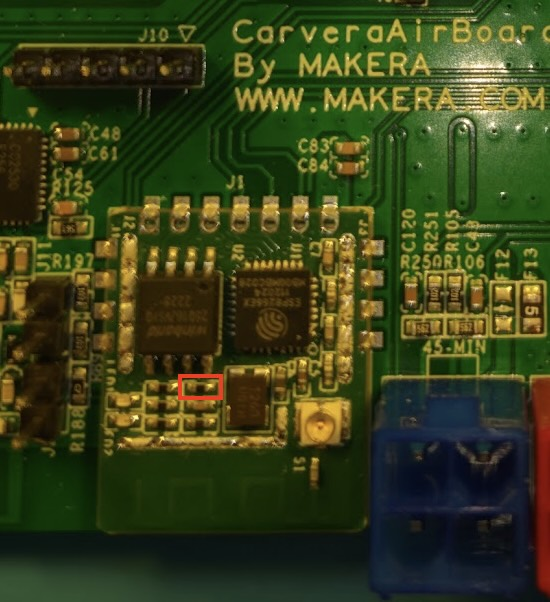
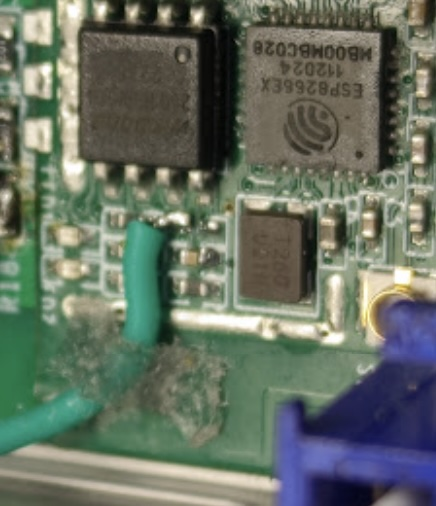
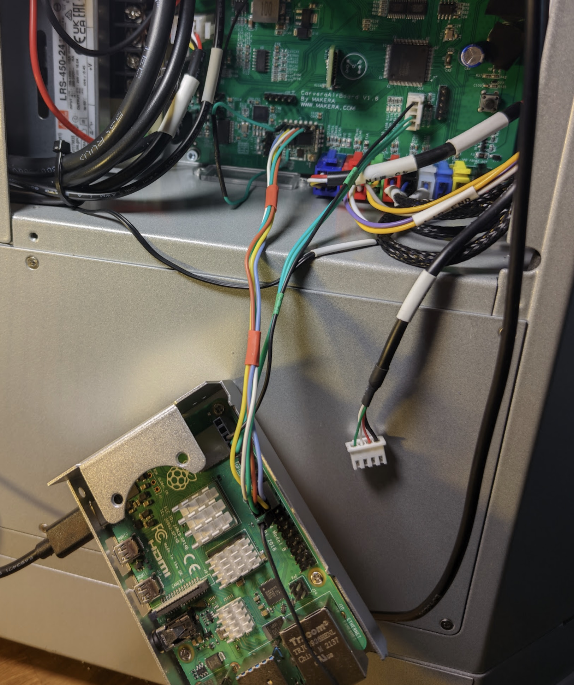
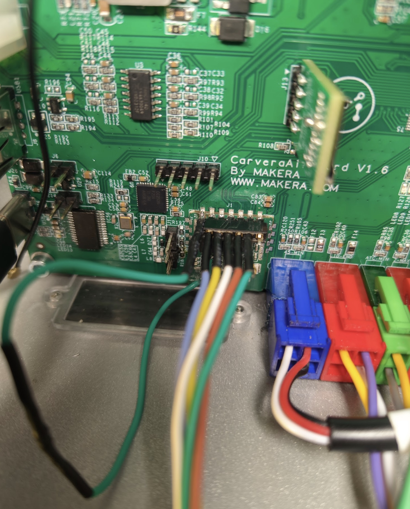
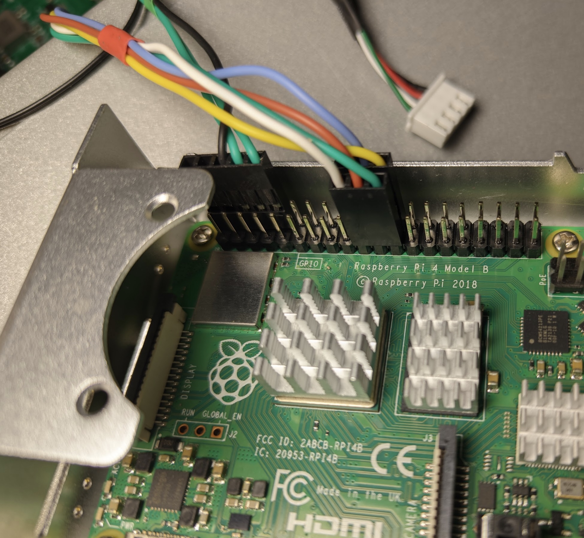

# electrophorus

**WARNING: The author(s) assume absolutely no responsibility for any damage
that might occur as a result of following the instructions below. This project is currently still is heavily work in
progress (almost nothing works!) and would work only on Carvera Air. Your warranty might no longer be valid since the
project requires physically modifying the machine's mainboard. DO NOT TRY THIS AT HOME unless you understand what you're
doing and are willing to deal with the issues and fix the bugs yourself (I might help with that, though).**

Electrophorus is a project that allows you to convert a Carvera-family desktop CNC milling machine
by [Makera Inc.](https://www.makera.com/)
to use [LinuxCNC](https://linuxcnc.org/) as a controller with the help of
a [Raspberry Pi](https://www.raspberrypi.com/). I (@f355) don't have the big-brother Carvera (C1), so for now it is
supposed to only work (or not) with Carvera Air (CA1).

The project has started as a fork of the fantastic [Remora](https://github.com/scottalford75/Remora) project. The Remora
authors [say they "dont ...not support"](https://github.com/scottalford75/Remora/issues/78#issuecomment-2584956914)
LPC1768-based boards, so this is a hard-fork, the changes are not intended to be upstreamed, and the code has been
pretty much rewritten.

## Making it work (Carvera Air)

The communication between the machine's board and the Raspberry Pi is done over the SPI bus. Unfortunately, both SSP/SPI
interfaces on the board are populated - SSP0 by the SD card and SSP1 by the ESP8266-based Wi-Fi module. We won't need
the latter, so we can modify the board to disable it and free up the bus. Conveniently, the module also provides vias to
solder a pin header into, with both SPI pins and power and ground connections for enabling/disabling the Wi-Fi module
and an extra MCU pin to use for the board reset/out-of-band communication.

You'll need the following:

1. Carvera Air machine, obviously
2. Raspberry Pi 4B (5 might work too, but it is untested) with a suitable power supply and a MicroSD card
3. MicroSD card reader
4. Good soldering iron/station and decent soldering skills, microscope or loupe is recommended, as well as other
   soldering accoutrements.
5. Cabling components:
    * Female Dupont pin header connectors compatible with the Raspberry Pi. A single 40-pin connector for the Pi is
      highly recommended, and you'll also need one single-pin connector for the ground.
    * 2mm pitch by 0.5mm pin size pin header, male for the Wi-Fi PCB (7 pins) and female for the cables (5 pins + 1 pin)
    * 4-pin female JST XH connector for the UART port. You should have one left over from wiring up
      the [3D probe](https://www.instructables.com/Carvera-Touch-Probe-Modifications/) :)
    * regular through-hole 10k resistor, brown-black-orange (anything from 4.7k to 100k should work too, but it's
      untested)
    * wires to tie it all together, of a suitable gauge

### Modifying the board

1. READ THESE INSTRUCTIONS TO THE END before attempting anything.
2. Remove the 0402 10k Ohm pull-up resistor from the ESP8266's `CHIP_EN` pin. It is marked in red on the
   picture:

3. Prepare the `CHIP_EN` wire: solder the through-hole 10k resistor in-line and heat-shrink it, tin one end, attach the
   single-pin 2mm-pitch female connector to the other.
4. Solder the wire you've just made to the LEFT (closer to the USB ports) pad of the resistor location as on the
   picture below. The pad is rather small and weak, so to avoid breaking the wire off or, worse, lifting the pad when
   installing the board back in the machine, you'll need a strain relief. Carefully bend the wire towards the PCB
   antenna portion of the WiFi module, optionally - especially if your wires have silicone insulation like mine - put a
   small rectangle of cloth or shop towel on top of it, hold the wire down and wick some CA glue between the wire and
   the PCB and in the cloth - it should look like the picture. Don't overdo it with the
   glue.

5. Solder the 7-pin 2mm-pitch pin header in the holes on top of the Wi-Fi module. You won't have access to the back of
   the PCB, the holes are blind, so it helps to move the plastic part of the header up the pins, solder them in and push
   the plastic bit back down.
6. The `CHIP_EN` wire, when connected to the right-most pin (3.3V) of the Wi-Fi module, enables it and allows you to use
   the stock firmware and controller as if no modifications were made. Connected to the left-most pin (ground), it
   disables the module, freeing up the SPI bus. It is recommended to leave the wire disconnected until the board is
   installed back in the machine - accidentally breaking the solder joint or lifting the pad is much more likely with a
   loop rather than with a free-dangling wire. Don't ask me how I know.

### Making the cables

* The Raspberry Pi pins are numbered according to
  the [official pinout](https://www.raspberrypi.com/documentation/computers/raspberry-pi.html#gpio).
* Keep the wires reasonably short - 10-15 cm is a good length.
* Double and triple check when done.
* **SPI connection.** Wi-Fi module pins are numbered left-to-right, starting with the pin closest to the USB ports

| Pin              | GND | RST    | SPI CS | SPI MOSI | SPI MISO | SPI CLK | 3V3 |
|------------------|-----|--------|--------|----------|----------|---------|-----|
| Wi-Fi module pin | 1   | 2      | 3      | 4        | 5        | 6       | 7   |
| RPi pin          | NC  | 22     | 24     | 19       | 21       | 23      | NC  |
| Color I used     | NC  | Purple | Yellow | White    | Orange   | Green   | NC  |

* **UART connection.** On the Carvera side, it is the 4-pin JST XH connector just below the MCU, where the unused CAM
  cable was plugged in. Pins are numbered top-to-bottom, according to the silkscreen. **NOTE: the board RX should be
  connected to the RPi TX and vice versa!**

| Pin          | GND   | VCC  | RX/TX  | TX/RX   |
|--------------|-------|------|--------|---------|
| Carvera pin  | 1     | 2    | 3 (RX) | 4 (TX)  |
| RPi pin      | 6     | NC   | 8 (TX) | 10 (RX) |
| Color I used | Black | None | Green  | Green   |

* (Optional) **Extra ground.** Connect one of the Raspberry Pi ground pins (e.g. 25 or 14) to pin 4 of the connector
  J10 on the Carvera board, numbered according to the silkscreen (second from the left).

All connected together, it should look something like this. The extra ground is temporarily disconnected, as I used it
for the oscilloscope ground. Don't mind the dangling Pi and please excuse the crudity of the model, I didn't have time
to build it to scale or to paint it.

The Carvera side:

The Pi side:

Coming up with a way to permanently mount the Raspberry Pi while providing adequate cooling is left as an exercise to
the reader.

### Building the firmware

Due to historical reasons, the project is using Mbed OS 5.x which is pretty tricky to get working with any sensible
build tooling - the Mbed CLI drops into a dependency hell on modern systems.

Don't bother, just download the Mbed Studio, open this directory, choose the `mbed LPC1768` target and the `Release`
profile, then build. If all goes well, you should get the `firmware.bin` under `BUILD/LPC1768/ARMC6`.

That said, the entire Mbed project is deprecated and Mbed Studio builds stuff in the cloud, so we should expect the
servers to get turned off soon and break Mbed Studio. The plan is to either migrate
to [mbed-ce](https://github.com/mbed-ce), clang and CMake, or to pick out just the needed bits of Mbed like the
stock/community firmware does.

After building the firmware, you'll need to put it in the root folder of the SD card as usual. The firmware is not using
the SD card at all, so you can leave the rest of the files on it. We're also not touching the bootloader, so to go back
to the stock firmware you just need to download it, rename it to `firmware.bin` and put it on the SD card.

### Configuring LinuxCNC

Coming soon, carefuling is in progress.

## Historical: Remora - the original README

The full documentation is at <https://remora-docs.readthedocs.io/en/latest/>
Note: Docs have not been updated for 1.0.0_rc

Remora is a free, opensource LinuxCNC component and Programmable Realtime Unit (PRU) firmware to allow LPC176x and
STM32F4 based controller boards to be used in conjuction with a Raspberry Pi to implement a LinuxCNC based CNC
controller.

Having a low cost and accessable hardware platform for LinuxCNC is important if we want to use LinuxCNC for 3D printing
for example. Having a controller box the size of the printer itself makes no sense in this applicatoin. A SoC based
single board computer is ideal in this application. Although developed for 3D Printing, Remora (and LinuxCNC) is highly
flexible and configurable for other CNC applications.

Remora has been in use amd development since 2017. Starting on Raspberry Pi 3B and 3B+ eventhough at the time it was
percieved that the Raspberry Pi was not a viable hardware for LinuxCNC.

With the release of the RPi 4 the LinuxCNC community now supports the hardware, with LinuxCNC and Preempt-RT Kernel
packages now available from the LinuxCNC repository. This now greatly simplifies the build of a Raspberry Pi based CNC
controller.
